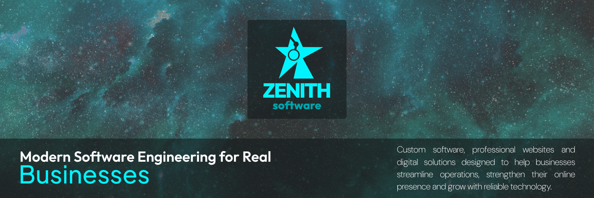
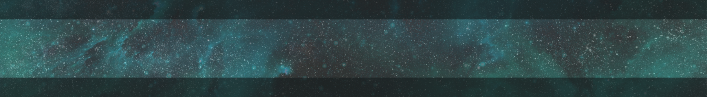
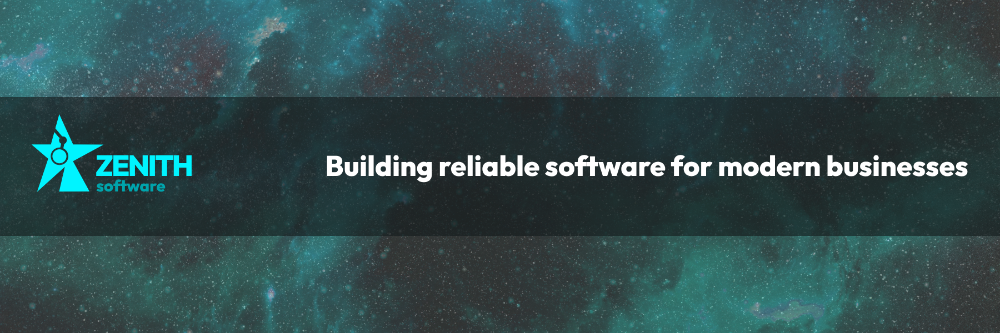

  

 

---

# About

Zenith Software develops modern digital solutions focused on quality, maintainability and long-term scalability.

Our goal is to provide businesses with software that solves real operational problems while maintaining clean architecture, excellent user experience and reliable infrastructure.

Projects are built using modern technologies and engineering practices, prioritizing performance, security and maintainability from day one.

  

## Services

| 🌐 Web Development | ⚙️ Software Development | 📱 Mobile Development |
|:------------------|:------------------------|:-----------------------|
| Landing Pages | Business Applications | Cross-platform Apps |
| Corporate Websites | SaaS Platforms | Android |
| Multi-page Websites | Internal Systems | iOS |
| SEO Optimization | Dashboards | React Native |
| Responsive Design | Workflow Automation | Customer Apps |
| Custom Solutions | Administrative Panels | Business Tools |

  

## Technology Stack

### Backend

&nbsp;&nbsp;

<picture>
  <source media="(prefers-color-scheme: dark)" srcset="./assets/tech/springboot-light.svg">
  
</picture>

&nbsp;&nbsp;

<picture>
  <source media="(prefers-color-scheme: dark)" srcset="./assets/tech/nodedotjs-light.svg">
  
</picture>

---

### Frontend

&nbsp;&nbsp;

<picture>
  <source media="(prefers-color-scheme: dark)" srcset="./assets/tech/nextdotjs-light.svg">
  
</picture>

---

### Mobile

---

### Databases

<picture>
  <source media="(prefers-color-scheme: dark)" srcset="./assets/tech/postgresql-light.svg">
  
</picture>

&nbsp;&nbsp;

&nbsp;&nbsp;

<picture>
  <source media="(prefers-color-scheme: dark)" srcset="./assets/tech/mongodb-light.svg">
  
</picture>

---

### Infrastructure

&nbsp;&nbsp;

<picture>
  <source media="(prefers-color-scheme: dark)" srcset="./assets/tech/vercel-light.svg">
  
</picture>

&nbsp;&nbsp;

<picture>
  <source media="(prefers-color-scheme: dark)" srcset="./assets/tech/supabase-light.svg">
  
</picture>

&nbsp;&nbsp;

<picture>
  <source media="(prefers-color-scheme: dark)" srcset="./assets/tech/docker-light.svg">
  
</picture>

&nbsp;&nbsp;

---

### UI / UX

&nbsp;&nbsp;

<picture>
  <source media="(prefers-color-scheme: dark)" srcset="./assets/tech/greensock-light.svg">
  
</picture>

&nbsp;&nbsp;

<picture>
  <source media="(prefers-color-scheme: dark)" srcset="./assets/tech/framer-light.svg">
  
</picture>

&nbsp;&nbsp;

<picture>
  <source media="(prefers-color-scheme: dark)" srcset="./assets/tech/threedotjs-light.svg">
  
</picture>

---

### Design

&nbsp;&nbsp;

&nbsp;&nbsp;

&nbsp;&nbsp;

  

# Engineering Principles

- Clean Architecture
- Responsive Design
- API-first Development
- Scalable Systems
- Performance-Oriented Development
- Security by Design
- Maintainable Codebase
- Long-Term Support

---

# Current Focus

- Business Software
- SaaS Platforms
- Corporate Websites
- Mobile Applications
- Internal Tools
- Workflow Automation

  

