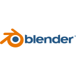

# Zenith Software

### Modern Software Engineering for Real Businesses

Custom software, professional websites and digital solutions designed to help businesses streamline operations, strengthen their online presence and grow with reliable technology.

 

---

# About

Zenith Software develops modern digital solutions focused on quality, maintainability and long-term scalability.

Our goal is to provide businesses with software that solves real operational problems while maintaining clean architecture, excellent user experience and reliable infrastructure.

Projects are built using modern technologies and engineering practices, prioritizing performance, security and maintainability from day one.

---

# Services

### Web Development

- Landing Pages
- Corporate Websites
- Multi-page Websites
- Custom Web Solutions

### Software Development

- Business Applications
- Internal Management Systems
- SaaS Products
- Dashboards
- Workflow Automation
- Administrative Panels

### Mobile Development

- Cross-platform Applications
- Business Mobile Apps
- Customer Applicationn

---

## Technology Stack

<table>
<tr>
<td valign="top" width="50%">

### Backend

  
  
  

### Frontend

  
  

### Mobile

  

</td>

<td valign="top" width="50%">

### Databases

  
  
  

### Infrastructure

  
  
  
  
  

### UI / UX

  
  
  
  

### Design

  
  
  
  

</td>
</tr>
</table>

---

# Engineering Principles

- Clean Architecture
- Responsive Design
- API-first Development
- Scalable Systems
- Performance-Oriented Development
- Security by Design
- Maintainable Codebase
- Long-Term Support

---

# Current Focus

- Business Software
- SaaS Platforms
- Corporate Websites
- Mobile Applications
- Internal Tools
- Workflow Automation

---

# Contact

**LinkedIn**
https://www.linkedin.com/company/zenith-software-ltda

---

**Zenith Software**

Building reliable software for modern businesses.

